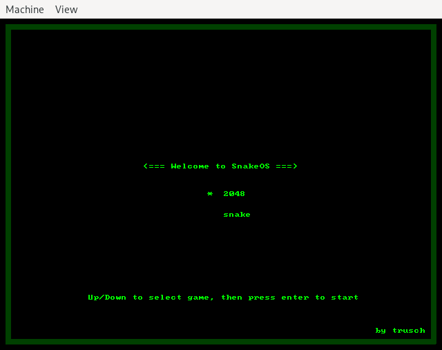
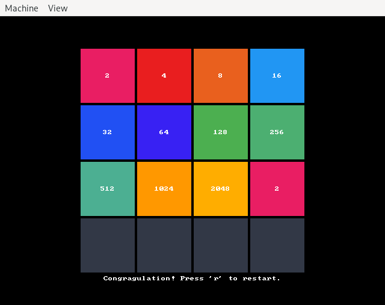

# SnakeOS

This is the game snake, bootable on a x86_64 CPU, written completely in rust. Its foundation is following the very interesting [Writing an OS in Rust](https://os.phil-opp.com/) blog which I would recommend everybody who is interested in this kind of stuff.

But it's not just snake. Thanks to @MoZhonghua its now possible to add different games to the OS and to play them. So apart from snake you can also enjoy a round of 2048.


## Features

* Play snake or 2048 on any x86_64 CPU
    * Let's have fun!
* Dynamic memory management
    * The snake can grow!
* Interrupt handling
    * We can read the keyboard!
* Async/Await support
    * We can update the world and read user input at the same time!
* Only 226kB kernel size
    * You can even put this on a 8-inch floppy disk!
* All the infrastructure you need to implement and play a game
    * You can implement your own game!

## Build it

Use the Makefile to build the game. 
The only dependencies are `podman` and `buildah` which are used to setup the build environment.

```
make snakeos.img
```

This will first setup a build container with the necessary dependencies and then build the game.

Alternatively, you can use the rust compiler directly with some tricks applied:

```
rustup override set nightly
rustup toolchain install nightly
rustup component add rust-src --toolchain nightly-x86_64-unknown-linux-gnu
rustup component add llvm-tools-preview
cargo run \
    --release \
    --target x86_64-custom.json \
    -Zbuild-std=core,alloc \
    -Zbuild-std-features=compiler-builtins-mem -- \
        --no-run
ln -sf target/x86_64-custom/release/boot-bios-snakeos.img snakeos.img
```

To now run the game, you can use the following command:

```
make run
```

which will actually run `qemu-system-x86_64 --enable-kvm -drive format=raw,file=snakeos.img` for you. From here you can use either `w`, `a`, `s` and `d` or the arrow keys to control the snake.


## Screenshots





