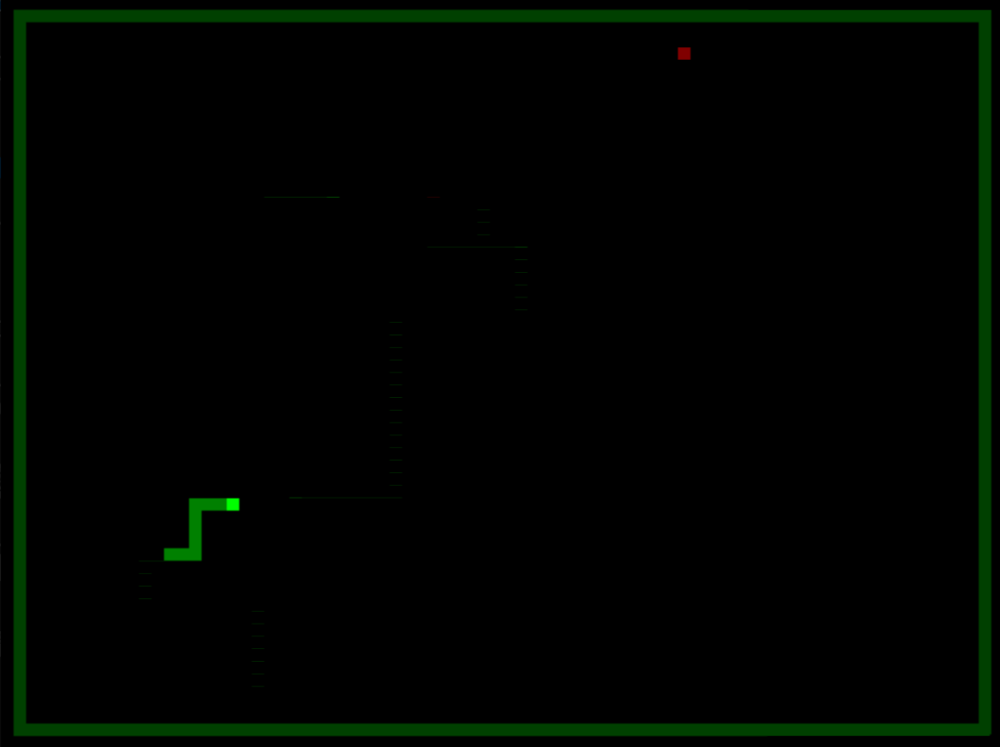

# SnakeOS

This is the game snake, bootable on a x86_64 CPU, written completely in rust. It's foundation is following the very interesting [Writing an OS in Rust](https://os.phil-opp.com/) blog which I would recommend everybody who is interested in this kind of stuff.



## Features

* Play snake on any x86_64 CPU
    * Let's have fun!
* Dynamic memory management
    * The snake can grow!
* Interrupt handling
    * We can read the keyboard!
* Async/Await support
    * We can update the world and read user input at the same time!
* Only 212kB kernel size
    * You can even put this on a 8-inch floppy disk!

## Build it

Use the Makefile to build the game. 
The only dependencies are `podman` and `buildah` which are used to setup the build enviroment.

```
make snakeos.img
```

This will first setup a build container with the necessary dependencies and then build the game.

To run the game, you can use the following command:

```
make run
```

which will actually run `qemu-system-x86_64 --enable-kvm -drive format=raw,file=snakeos.img` for you. From here you can use either `w`, `a`, `s` and `d` or the arrow keys to control the snake.

